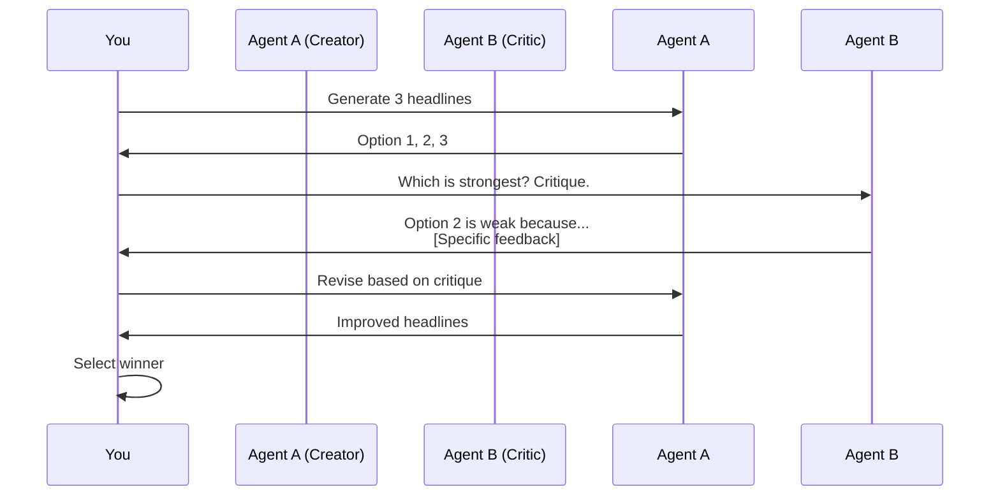
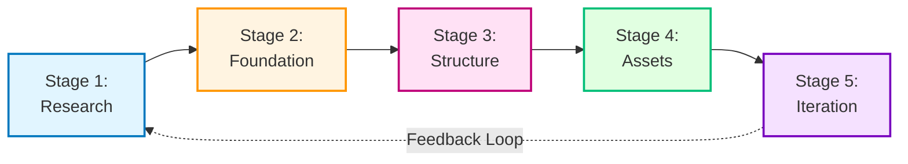
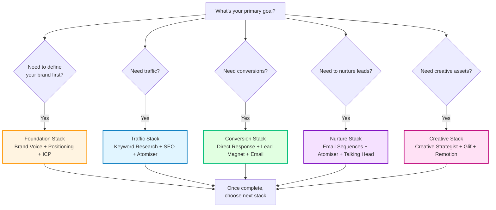

# The AI-Driven Marketing System — Builder's Guide

> A practical toolkit for architecting, building, and operating an AI-augmented marketing system.
> No hype. No sales copy. Just the full system, documented for immediate use.

---

## Table of Contents

### Part 1 — Philosophy & First Principles

- 1.1 What "Vibe Marketing" actually means
- 1.2 Core principles: Methodology over Prompts, Research over Assumptions, Systems over Shortcuts
- 1.3 The "Confidently Boring" positioning thesis
- 1.4 Compound growth vs. campaign thinking
- 1.5 The three layers: Research (MCPs) → Methodology (Skills) → Process (5-Stage Sequence)

### Part 2 — The Tool Stack

- 2.1 The IDE-centric workspace: Windsurf / Antigravity / Codex + Claude Code CLI
- 2.2 Voice input: Typeless
- 2.3 The Execution & Knowledge Layer: Airtable + Notion
- 2.4 MCPs (Model Context Protocol) — the research layer
- 2.5 Cost model: Claude Max subscription economics

### Part 3 — The 17 Skills (Full Inventory)

- 3.1 What a "Skill" is — structure, invocation, and why it beats raw prompting
- 3.2 Skill catalogue with purpose and primary output
- 3.3 Skill build sequence — what to build first and in what order
- 3.4 Installation in the Antigravity stack
- 3.5 Key Frameworks Deep Dive (6 Circles, Schwartz, AIDA, JTBD)
- 3.6 Skill Anatomy: How to Build Your Own (3 Examples)

### Part 4 — The Decision Framework

- 4.1 The problem: "too many options" paralysis
- 4.2 Task-based expert agents
- 4.3 AI Ping-Pong: using models to critique each other
- 4.4 Expert Review checkpoints
- 4.5 Constraint filtering

### Part 5 — The 5-Stage Build Sequence

- 5.1 Stage 1: Research
- 5.2 Stage 2: Foundation
- 5.3 Stage 3: Structure
- 5.4 Stage 4: Assets
- 5.5 Stage 5: Iteration

### Part 6 — Skill Stacking Patterns

- 6.1 Foundation Stack
- 6.2 Conversion Stack
- 6.3 Traffic Stack
- 6.4 Nurture Stack
- 6.5 Creative Stack
- 6.6 Full Orchestration

### Part 7 — The Weekly Content Engine

- 7.1 The pillar content model: one theme, one deep piece, infinite derivatives
- 7.2 Written pillar → YouTube/Podcast conversation structure
- 7.3 Content atomisation: slicing for every platform
- 7.4 The compound flywheel

### Part 8 — Use Cases by Business Type

- 8.1 AI Agency / Consultancy
- 8.2 Recruitment AI (Talent Aisle)
- 8.3 Fintech / Regulated Industries
- 8.4 Service Businesses
- 8.5 E-commerce / DTC
- 8.6 SaaS
- 8.7 Special Case: The Founder's Voice System (Personal Brand)

### Part 9 — Traffic Strategies (Deep Dive)

- 9.1 SEO: The Long Game
- 9.2 Paid: Creative at Scale
- 9.3 Organic: The Compound Engine

### Part 10 — Remotion: Programmatic Video Ads

- 10.1 What Remotion is and why it matters
- 10.2 Setup & project structure
- 10.3 Multi-format output
- 10.4 Cost model

### Part 11 — The Prompt Strategy

- 11.1 The Core Prompt Categories
- 11.2 How to Use the Library
- 11.3 Essential Prompts (Examples)

### Part 12 — Quick Start & Operational Checklists

- 12.1 One-time setup checklist
- 12.2 Before each session
- 12.3 During each session
- 12.4 After each session

### Part 13 — Your First 30 Days

- Week 1: Foundation (Build the Core)
- Week 2: Ship Your First Asset
- Week 3: Turn On Traffic
- Week 4: Iterate (Close the Loop)
- Beyond Day 30: The Compound Playbook

---

## Part 1 — Philosophy & First Principles

### 1.1 What "Vibe Marketing" Actually Means

Vibe Marketing is the application of the same agentic, AI-first workflow used in Vibe Coding — but directed at commercial growth instead of product development.

The core idea: **stay in the terminal, stay in flow, and use AI agents to build marketing systems at the same velocity you build software.**

It is not:

- Just "using ChatGPT to write copy"
- Prompt engineering with better templates
- Replacing marketers with AI

It is:

- **Loading AI agents with expert methodology** (Skills), not just instructions (prompts)
- **Using real-time research tools** (MCPs) to ground every output in actual market data
- **Building complete systems** — positioning, copy, design, traffic, nurture — in a single session
- **Operating from the same workspace** where you build your product

The power is that product work and marketing work happen in the same place, using the same tools and the same context.

### 1.2 Core Principles

| Principle                             | What it means in practice                                                                                                                                                                                                                      |
| ------------------------------------- | ---------------------------------------------------------------------------------------------------------------------------------------------------------------------------------------------------------------------------------------------- |
| **Methodology over Prompts**          | A prompt is an instruction. A Skill is an expert framework. The difference: prompts produce generic output. Skills produce output informed by Schwartz, Hopkins, Ogilvy — years of proven methodology compressed into executable instructions. |
| **Research over Assumptions**         | Never start with a blank page. Spend 30–60 minutes minimum using Perplexity MCP, Firecrawl, and Playwright to deeply understand the market, competitors, customer language, and positioning gaps*before* generating anything.                  |
| **Systems over Shortcuts**            | Don't chase hacks. Build systems that compound. A landing page is a tactic. A positioning framework + copy system + lead magnet + email sequence + traffic engine is a*system*. Systems survive; tactics decay.                                |
| **Human Taste is the Differentiator** | AI generates options. Your judgement picks winners. Everyone has access to the same models. The competitive advantage is*taste* — knowing what's good, what resonates, what's authentic.                                                       |
| **Task-Based Agents Win**             | Don't rely on a single context window for everything. Spin up specialised agents — SEO expert, conversion expert, creative strategist — each with fresh context and a defined job. Consensus across agents = signal.                           |

### 1.3 The "Confidently Boring" Positioning Thesis

Most AI marketing content sells hype. "10x your revenue." "Revolutionary." "Game-changing."

The Vibe Marketing counter-position: **Confidently Boring.**

- Target the businesses everyone else ignores — HVAC, plumbing, manufacturing, trades, distribution. These are $2–10M businesses with real revenue, real margins, and zero marketing sophistication.
- Lean into the unsexy fundamentals that actually drive results.
- Let the compound effect do the work while everyone else chases the next viral tactic.

**Vocabulary discipline:**

| ✅ Use                                            | ❌ Avoid                             |
| ------------------------------------------------- | ------------------------------------ |
| "Boring" / "unsexy" / "overlooked"                | "Revolutionary" / "game-changing"    |
| "Compound" / "compounds over time"                | "Crushing it" / "killing it" / "10x" |
| "Actually works" / "what actually drives results" | "Leverage" / "synergy" / "optimize"  |
| Specific numbers and timeframes                   | "Unlock your potential"              |
| "Here's how" / "Here's what we did"               | Buzzwords without substance          |

This is not just a positioning angle — it's a content creation filter. Every piece of output should pass the "Confidently Boring" test: _Is it substantive? Is it specific? Would a pragmatic business owner trust it?_

### 1.4 Compound Growth vs. Campaign Thinking

| Campaign Thinking               | Compound Thinking                                                  |
| ------------------------------- | ------------------------------------------------------------------ |
| Launch → spike → decay → repeat | Build → publish → compound → accelerate                            |
| Each campaign starts from zero  | Each asset builds on the last                                      |
| Dependent on budget             | Dependent on consistency                                           |
| Measures: impressions, clicks   | Measures: organic growth rate, email list velocity, referral loops |

The compound model:

1. Best clients come from best clients.
2. Content builds reputation.
3. Reputation generates referrals.
4. Referrals become case studies.
5. Case studies become content.
6. Repeat.

Every asset you create — a landing page, a blog post, an email sequence, a video ad — is a permanent node in the system. It doesn't expire. It compounds.

### 1.5 The Three Layers

Vibe Marketing works because it stacks three layers that most people try to collapse into prompting alone.


**Layer 1 — Research (MCPs):** Real-time access to market data, competitor websites, search trends. This is the foundation. Without it, everything downstream is guesswork.

**Layer 2 — Methodology (Skills):** Markdown files containing codified expert frameworks. Direct response copywriting principles. Positioning angle frameworks. SEO content methodology. These turn a general-purpose LLM into a specialist.

**Layer 3 — Process (The Sequence):** The order matters. Research before positioning. Positioning before copy. Copy before design. Skip a step and everything downstream suffers. The 5-Stage Build Sequence (Part 5) enforces this discipline.

---

## Part 2 — The Tool Stack

> "I like to be in one place. Use MCPs to bring tools to me versus having to go around to different tools."

The Vibe Marketing stack is designed for **velocity**. Velocity comes from minimizing context switching. Instead of tab-switching between ChatGPT, Google Docs, Midjourney, and Semrush, everything happens inside the terminal.

### 2.1 The IDE-centric Workspace

- **Windsurf / Antigravity / Codex:** The cockpit. Where files live.
- **Claude Code CLI:** The engine. It has file access, can run terminal commands, and orchestrates the other tools.
  - **Why:** Unlike a chat interface, the CLI can _see_ your project structure, _read_ your skills files, and _write_ the output directly to the correct folder.

### 2.2 Voice Input: Typeless

- **Tool:** Typeless (high-fidelity voice-to-text).
- **Role:** Formatting instructions and context without typing friction.
- **Impact:** ~2x velocity increase. It allows for "stream of consciousness" instruction which Claude then structures into structured data or code.

### 2.3 The Execution & Knowledge Layer

- **Airtable:** The source of truth for planning, execution database, content calendar, and CRM.
- **Notion:** Internal wikis, documentation, and client-facing lead magnets (e.g., public pages). _Optional but high-utility._

### 2.4 MCPs (The Research Layer)

The Model Context Protocol (MCP) connects Claude to the outside world.

| MCP            | Function                         | Application in Marketing                                                                          |
| -------------- | -------------------------------- | ------------------------------------------------------------------------------------------------- |
| **Perplexity** | Real-time deep search            | "Research the top 5 competitors for [niche] and find their pricing."                              |
| **Firecrawl**  | Bulk website scraping            | "Scrape these 100 competitor URLs and extract their H1s and Calls to Action."                     |
| **Playwright** | Browser automation & Screenshots | "Go to [Competitor URL] and take a full-page screenshot so I can analyze their design hierarchy." |
| **Glif**       | Creative generation              | "Generate 5 variations of an image for this ad concept using our brand palette."                  |

### 2.5 Cost Model: The "Claude Max" Economics

| Item               | Cost                     | vs Traditional Agency                |     |
| ------------------ | ------------------------ | ------------------------------------ | --- | --- |
| **Claude Max Sub** | ~$200/mo                 | **Retainer:** $5,000 - $15,000/mo    |     |     |
| **MCP API Costs**  | Usage-based (negligible) | **Headcount:** $60k+/yr per role     |     |
| **Remotion**       | $0 (Open Source)         | **Video Production:** $5k+ per video |     |     |
| **Total**          | **~$250/mo**             | **$10k+/mo**                         |     |     |

**The Leverage:** A single "Vibe Marketer" using this stack can output the volume of a 5-person agency team (Strategist, Copywriter, Designer, SEO Specialist, Dev).

---

## Part 3 — The 17 Skills (Full Inventory)

> "A skill is an instruction manual for your agent. It turns Claude from a generalist into a specialist."

### 3.1 What a "Skill" Is

Most people write prompts like: _"Write a landing page for my agency."_

A **Skill** is a markdown file (`.md`) that contains:

1. **The Role:** "You are a direct response copywriter trained by Eugene Schwartz."
2. **The Framework:** "Follow these 5 stages of market awareness."
3. **The Constraints:** "Never use passive voice. Never use the word 'delve'."
4. **The Output Format:** "Return the result as a markdown file with H1, H2, and CTA blocks."

When you direct Claude to "Use the Direct Response Copy skill," it loads this entire methodology into its context before writing a single word.

### 3.2 Skill Catalogue

#### Foundation Skills

| #   | Skill                  | Purpose                                                                                        |
| --- | ---------------------- | ---------------------------------------------------------------------------------------------- |
| 1   | **Brand Voice**        | Analyze existing content → extract voice profile (vocabulary, tone, constraints).              |
| 2   | **Positioning Angles** | Generate 3-5 distinct angles (e.g., "The Contrarian," "The Speed Mechanism," "The Anti-Guru"). |
| 3   | **ICP Deep Dive**      | Map the ideal customer's pain, fears, and dreams in granular detail.                           |

#### Conversion Skills

| #   | Skill                    | Purpose                                                                        |
| --- | ------------------------ | ------------------------------------------------------------------------------ |
| 4   | **Direct Response Copy** | Landing pages, ads, emails (Schwartz/Hopkins methodology).                     |
| 5   | **Lead Magnet**          | Ideate high-value assets (calculators, audits, swipe files) over generic PDFs. |
| 6   | **Email Sequences**      | "Deliver → Connect → Value → Pitch" framework for welcome/nurture flows.       |
| 7   | **SEO Content**          | Long-form, human-verified content that ranks.                                  |

#### Traffic Skills

| #   | Skill                      | Purpose                                                                       |
| --- | -------------------------- | ----------------------------------------------------------------------------- |
| 8   | **Keyword Research**       | 6 Circles Method for gap identification and "low-hanging fruit."              |
| 9   | **Content Atomizer**       | 1 long-form piece → 15+ platform-specific assets (LinkedIn, Twitter, Shorts). |
| 10  | **AI Creative Strategist** | Competitor ad analysis → creative briefs for designers/AI.                    |
| 11  | **AI Social Graphics**     | Briefs/prompts for platform-native visuals.                                   |
| 12  | **AI Product Photo**       | Hero shots and lifestyle imagery generation.                                  |
| 13  | **AI Product Video**       | Product reveals and demo scripts for Remotion/Glif.                           |
| 14  | **AI Talking Head**        | UGC-style scripts and generation for founder-led content.                     |

#### Orchestration Skills

| #   | Skill               | Purpose                                                               |
| --- | ------------------- | --------------------------------------------------------------------- |
| 15  | **Orchestrator**    | "I'm stuck." Analyzes current state → recommends next best action.    |
| 16  | **Frontend Design** | Production HTML/CSS without the "AI aesthetic" (no purple gradients). |
| 17  | **Remotion**        | Programmatic video ad creation commands and code.                     |

### 3.3 Skill Build Sequence

Don't build all 17 at once. Build them in this order to ship faster:

1. **The Core Trio:** Brand Voice, Positioning Angles, Direct Response Copy. (Enough to launch a landing page).
2. **The Traffic Trio:** Keyword Research, Content Atomizer, SEO Content. (Start the engine).
3. **The Nurture Duo:** Lead Magnet, Email Sequences. (Capture value).
4. **The Creative Layer:** All visual/video skills. (Scale ads).

### 3.4 Installation in Your Stack

In **Antigravity / Windsurf**, store skills in a dedicated `marketing-skills/` directory or within your `.agent/skills/` folder.

**Invocation:**
Instead of pasting the skill every time, use the file reference:

> _"Claude, read `marketing-skills/direct-response-copy.md` and write a landing page for..."_

This keeps your prompt window clean and ensures version control on your marketing methodology.

### 3.5 Key Frameworks Deep Dive

The Skills reference proven marketing frameworks. Here are the core methodologies you need to understand:

#### The 6 Circles Keyword Research Method

This framework helps you identify keyword opportunities by mapping the **intent gap** between what people search and what competitors target.

**The 6 Circles:**

1. **Circle 1 — Problem Aware Keywords:** "How to fix [Problem]"
2. **Circle 2 — Solution Aware Keywords:** "Best [Solution Type]"
3. **Circle 3 — Product Aware Keywords:** "[Your Product] vs [Competitor]"
4. **Circle 4 — Brand Aware Keywords:** "[Your Brand Name] + [Feature]"
5. **Circle 5 — Low-Hanging Fruit:** High intent, low competition (the gap competitors missed)
6. **Circle 6 — Future State:** Aspirational keywords (where the market is going, not where it is)

**Application:** Use Perplexity to map competitor content against these circles. Find Circle 5 — the keywords they're ignoring.

#### Schwartz's 5 Stages of Market Awareness

Eugene Schwartz's _Breakthrough Advertising_ identified that **how** you write copy depends entirely on **what the customer already knows**.


| Stage                 | Customer Knows                           | Your Approach                         | Example Headline                                    |
| --------------------- | ---------------------------------------- | ------------------------------------- | --------------------------------------------------- |
| **1. Unaware**        | Doesn't know they have a problem         | Educate first                         | "Why your accounting is costing you £50k/year"      |
| **2. Problem Aware**  | Knows the pain, not the solution         | Agitate → Introduce solution category | "Tired of chasing invoices? Here's what works."     |
| **3. Solution Aware** | Knows solutions exist, not YOUR solution | Differentiate                         | "Most accountants take 5 days. We take 5 hours."    |
| **4. Product Aware**  | Knows you exist, not convinced           | Overcome objections                   | "Why [Product] works when [Generic Solution] fails" |
| **5. Most Aware**     | Ready to buy, needs a nudge              | Offer + Urgency                       | "Get [Offer] before Friday—only 10 spots left"      |

**Application:** Before writing _any_ copy, ask: "What stage is the reader at?" Then match the message to the awareness level.

#### The AIDA Framework (Direct Response Structure)

**A**ttention → **I**nterest → **D**esire → **A**ction

This is the skeleton of every high-converting landing page, email, or ad.

1. **Attention:** The headline. Must stop the scroll.
2. **Interest:** The problem articulation. "You feel X because of Y."
3. **Desire:** The transformation. "Imagine Z instead."
4. **Action:** The CTA. One clear next step.

**Application:** Every asset passes through this filter. No AIDA = No conversion.

#### The "Jobs to Be Done" Framework

Customers don't buy products. They "hire" them to solve a specific job.

**The Question:**
"When [Situation], I want to [Motivation], so I can [Outcome]."

**Example:**

- Generic: "I need project management software."
- JTBD: "When my team misses deadlines, I want real-time task visibility, so I can prevent last-minute chaos."

**Application:** Use this to reframe positioning. Sell the _outcome_ (prevent chaos), not the feature (Gantt charts).

### 3.6 Skill Anatomy: How to Build Your Own

Skills are structured markdown files. Here's how three core skills are actually built, so you can create your own.

---

#### **Example 1: Brand Voice Extraction Skill**

`marketing-skills/brand-voice.md`:

```markdown
# Brand Voice Extraction Skill

## Role

You are a brand voice analyst specialising in tone and vocabulary pattern recognition.

## Task

Extract a reusable voice profile from existing content.

## Process

1. **Analyse Input:** Review 3–5 pieces of provided content (emails, posts, articles).
2. **Identify Patterns:**
   - Core vocabulary (words used frequently)
   - Avoided words (what's never said)
   - Sentence structure (short/punchy vs. long/flowing)
   - Tone markers (humour, formality, authority)
3. **Define Rules:** Create 5 "Voice Laws" (e.g., "Always use active voice," "Never use corporate jargon").
4. **Generate Examples:** Write 3 sample sentences that embody the voice.

## Output Format

A markdown file (`voice_profile.md`) containing:

- Vocabulary Lexicon (Do use / Don't use)
- Tone Definition (3 adjectives)
- 5 Voice Rules
- 3 Example Sentences

## Constraints

- Be specific. "Professional" is useless. "Conversational but authoritative, like a trusted advisor" is useful.
- Test the rules. If an example sentence violates a rule, the rule is wrong.
```

**How it works:** This skill turns Claude into a specialist by giving it a clear role, process, and output format.

---

#### **Example 2: Direct Response Copy Skill**

`marketing-skills/direct-response-copy.md`:

```markdown
# Direct Response Copy Skill

## Role

You are a direct response copywriter trained in the methods of Eugene Schwartz, Claude Hopkins, and Gary Halbert.

## Frameworks to Apply

1. **Schwartz's 5 Stages of Awareness:** Match message to customer awareness level (see Part 3.5).
2. **AIDA:** Attention → Interest → Desire → Action.
3. **The 4 Ps:** Promise, Picture, Proof, Push.

## Process

1. **Diagnose Awareness:** Determine what stage the reader is at (Unaware → Most Aware).
2. **Craft the Hook:** The headline must trigger one of: curiosity, fear, or desire.
3. **Build the Body:**
   - Agitate the problem (make it visceral).
   - Introduce the solution (your offer).
   - Provide proof (case study, testimonial, data).
4. **Close with Clarity:** One CTA. One action. No ambiguity.

## Constraints

- Never use passive voice.
- Never use vague claims ("Best quality"). Use specifics ("3x faster than Excel").
- Never bury the CTA. It should be visible without scrolling.

## Output Format

A markdown file with:

- Headline (H1)
- Subheadline (H2)
- Body Copy (sections with H3s)
- CTA Block (clear, singular action)

## Self-Check

Before submitting, ask:

1. Does the headline pass the "scroll-stop" test?
2. Is the problem articulated in the reader's own language (check `customer_voice.md`)?
3. Is the CTA crystal clear?
```

**How it works:** This skill embeds proven frameworks and forces Claude to self-check against copywriting first principles.

---

#### **Example 3: Content Atomiser Skill**

`marketing-skills/content-atomiser.md`:

```markdown
# Content Atomiser Skill

## Role

You are a content atomisation specialist. Your job: turn 1 long-form piece into 15+ platform-specific assets.

## Input

- A long-form article (1,500–3,000 words) OR
- A video/podcast transcript (15+ minutes)

## Output Matrix

| Platform       | Format              | Quantity | Goal                  |
| -------------- | ------------------- | -------- | --------------------- |
| LinkedIn       | Long-form post      | 3        | Thought leadership    |
| Twitter/X      | Thread (3–5 tweets) | 2        | Insight distribution  |
| Twitter/X      | One-liner           | 3        | Virality/engagement   |
| YouTube Shorts | 60-second script    | 3        | Awareness             |
| Email          | Newsletter tease    | 1        | Drive to full content |

## Process

1. **Extract Core Ideas:** Identify the 5–7 key insights from the source material.
2. **Platform Adaptation:**
   - **LinkedIn:** Professional, structured, actionable. Include line breaks for readability.
   - **Twitter:** Punchy, provacative. Lead with the insight, not context.
   - **Shorts:** Hook in 3 seconds. One idea per video. End with CTA.
3. **Link Strategy:** Every piece must link back to either:
   - The full article (for SEO)
   - A lead magnet (for email capture)
   - The main product/offer (for conversion)

## Constraints

- Each piece must stand alone. No "Part 1 of 3."
- No copy-paste. Rewrite for the platform.
- Maintain brand voice (reference `voice_profile.md`).

## Output Format

A markdown file with sections:

- LinkedIn Posts (3)
- Twitter Threads (2)
- Twitter One-Liners (3)
- Short-Form Video Scripts (3)
- Email Newsletter Tease (1)

Each labelled: `## [Platform] — [Type] — [Number]`
```

**How it works:** This skill is a systematic extraction engine. It forces consistent output across all platforms without manual rewriting.

---

**Key Takeaway:** Every skill follows the same structure:

1. **Role:** Who is Claude pretending to be?
2. **Frameworks:** What proven methodologies apply?
3. **Process:** What are the steps?
4. **Constraints:** What must be avoided?
5. **Output:** What does success look like?

Use this template to build custom skills for your specific workflows.

---

## Part 4 — The Decision Framework

> "The biggest problem with AI isn't generation. It's choice overload."

When you can generate 100 headlines in 10 seconds, the bottleneck shifts from **creation** to **curation**. The Vibe Marketing system solves this with strict decision frameworks.

### 4.1 The Problem: "Too Many Options" Paralysis

Without a framework, you will:

1. Generate 50 ideas.
2. Feel overwhelmed.
3. Pick the most generic one because it feels "safe."
4. Ship mediocre work.

The goal is to use AI to **filter**, not just generate.

### 4.2 Spinning Up Task-Based Expert Agents

Don't ask one chat window to do everything. Treat your agents like a specialised team. Ensure you explicitly cast the role at the start of the session.

**The Specialist Roster:**

- **The SEO Specialist:**
  - Role: "You are a programmatic SEO expert focused on low-difficulty, high-intent keywords."
  - Job: Keyword research, site architecture, internal linking strategy.
- **The Conversion Expert (CRO):**
  - Role: "You are a disciple of Cialdini and behaviour design."
  - Job: Optimising landing pages, reducing friction, increasing email opt-ins.
- **The Creative Strategist:**
  - Role: "You are a creative director at a top London agency."
  - Job: Visual concepts, ad angles, brand aesthetics.

**Best Practice:** Open separate chat sessions/files for each role. Do not cross-contaminate contexts.

### 4.3 AI Ping-Pong: The Critique Loop

Use two different model instances (or personas) to critique each other's work.

1. **Agent A (Creator):** "Draft 3 landing page headlines for [Product]."
2. **Agent B (Critic):** "Review these 3 headlines. Which one is strongest? Critique the weak ones based on [Skill: Direct Response Copy]."
3. **Agent A (Iterator):** "Rewrite the headlines based on Agent B's feedback."

This "adversarial" loop produces significantly higher quality output than self-correction.

**Visual Workflow:**



### 4.4 Expert Review Checkpoints

Before you move to the next stage of the build, you must pass a quality gate. This stops you from building a house on shaky foundations.

**The Checkpoint Prompt:**

> "Review the work we just did against the [Relevant Skill] principles.
>
> 1. Score it out of 10.
> 2. List 3 specific things that make it weak.
> 3. Provide 1 concrete suggestion to improve it.
>    Do not be polite. Be critical."

**When to use it:**

- After defining positioning angles (Layer 2).
- After writing the first draft of copy (Layer 4).
- Before generating final visuals (Layer 4).

### 4.5 Constraint Filtering

The best way to get great creative is to **reduce** options, not expand them.

Instead of: _"Give me 10 ideas for a video."_
Use: _"Give me 3 video concepts that must be under 30 seconds, use no voiceover, and focus solely on the product's durability."_

**The Constraint Filter:**

1. Generate wide (10–20 ideas).
2. Apply constraints (must be X, cannot be Y).
3. Select the top 3.
4. Iterate deeply on those 3.

---

## Part 5 — The 5-Stage Build Sequence

> "This is how you go from 'I have an idea' to 'I have a system live' in one session."

This sequence is non-negotiable. Skip a step, and the output quality degrades.

### 5.1 Stage 1: Research (The Deep Dive)

**Goal:** Understand the market better than the competitors do.
**Tools:** Perplexity MCP, Firecrawl, Playwright.
**Time:** 30–60 minutes.

**Process:**

1. **Market Landscape:** "Perplexity, research the core problems in [Niche] and list the top 5 complaints customers have about current solutions."
2. **Competitor Audit:** "Firecrawl, scrape these 3 competitors. Extract their H1s, subheads, offers, and pricing."
3. **Visual Audit:** "Playwright, take screenshots of their landing pages. What colour palettes and layouts are they using?"
4. **Customer Voice:** "Find 20 real comments from Reddit/Amazon reviews about this problem. Create a `customer_voice.md` file with their exact phrasing."

**Output:** `research/` folder containing:

- `competitor_analysis.md`
- `customer_voice.md`
- `visual_audit_notes.md`

### 5.2 Stage 2: Foundation (The Strategy Layer)

**Goal:** Define who you are and why you matter.
**Tools:** Claude Code + Foundation Skills (1–3).
**Time:** 30 minutes.

**Process:**

1. **Feed Research:** "Claude, read everything in `research/`. Based on the complaints, where is the gap?"
2. **Define Angles:** "Use the `Positioning Angles` skill to generate 3 distinct angles for our offer."
3. **Codify Voice:** "Use the `Brand Voice` skill to define our tone. We want to be [Adjective 1] and [Adjective 2], but never [Adjective 3]."
4. **Map ICP:** "Use the `ICP Deep Dive` skill to profile our perfect customer."

**Output:** `foundation/` folder containing:

- `positioning_angles.md`
- `voice_profile.md`
- `icp_profile.md`

### 5.3 Stage 3: Structure (The Blueprint)

**Goal:** Map the system before building assets.
**Tools:** Claude Code + Traffic Skills (8).
**Time:** 15–30 minutes.

**Process:**

1. **Keyword Map:** "Use the 6 Circles framework to map keyword intent. What are they searching for _before_ they know they need us?"
2. **Site Architecture:** "Propose a sitemap. Home, Features, Pricing, and the specific SEO pages we need."
3. **Content Pillars:** "Identify the 3 core themes we will own."

**Output:** `structure/` folder containing:

- `sitemap.md`
- `keyword_map.md`
- `content_pillars.md`

### 5.4 Stage 4: Assets (The Production)

**Goal:** Create the actual deliverables.
**Tools:** Claude Code + Conversion Skills (4–7) + Creative Skills (10–14, 17).
**Time:** 60–90 minutes.

**Process:**

1. **Copy First:** "Read `foundation/` and `structure/`. Use the `Direct Response Copy` skill to write the Homepage copy."
2. **Lead Magnet:** "Create the content for a high-value Lead Magnet (e.g., a calculator logic or a checklist)."
3. **Email Sequence:** "Write a 5-day nurture sequence for leads who download the magnet."
4. **Visuals:** "Generate social graphics for the launch content using Glif."
5. **Video:** "Generate a script for a Remotion video ad. Then build the component."

**Output:** `assets/` folder containing production-ready files.

### 5.5 Stage 5: Iteration (The Compound Loop)

**Goal:** Improve based on data.
**Tools:** Orchestrator Skill (15) + Expert Review.
**Time:** Ongoing.

**Process:**

1. **Review:** "Expert Review, critique the Landing Page against the copy skill."
2. **Test:** Run traffic.
3. **Atomise:** Take the best performing angle and explode it into 15 social posts using the `Content Atomizer` skill.
4. **Loop:** Feed performance data back into `research/` for the next cycle.

**Visual Overview:**



---

## Part 6 — Skill Stacking Patterns

> "Individual skills are powerful. Stacks are systems. Here are the winning combinations."

Don't use random skills. Use these pre-defined "recipes" to achieve specific outcomes.

**Quick Navigator:**



Don't use random skills. Use these pre-defined "recipes" to achieve specific outcomes.

### 6.1 The Foundation Stack (Start Here)

**Objective:** Define the brand DNA so every subsequent output sounds like you.
**Sequence:**

1. **Brand Voice (Skill 1):** Scrape your best 3 emails/posts → "This is our voice."
2. **Positioning Angles (Skill 2):** "Given this voice, what are our 3 most contrarian stances?"
3. **ICP Deep Dive (Skill 3):** "Given these stances, exactly who resonates with this?"

**Result:** A `brand_bible.md` that you feed into _every future session_.

### 6.2 The Conversion Stack

**Objective:** Turn cold traffic into leads.
**Sequence:**

1. **Direct Response Copy (Skill 4):** Write the Landing Page (LP).
2. **Lead Magnet (Skill 5):** Design the asset they get for signing up.
3. **Email Sequences (Skill 6):** The automated flow they receive immediately after.
4. **Frontend Design (Skill 16):** The HTML/CSS to make the LP real.

**Result:** A complete funnel. Traffic in → Emails out.

### 6.3 The Traffic Stack

**Objective:** Get attention (Organic).
**Sequence:**

1. **Keyword Research (Skill 8):** Identify the "Long Tail" questions.
2. **SEO Content (Skill 7):** Answer those questions with 2,000-word deep dives.
3. **Content Atomizer (Skill 9):** Turn that 1 deep dive into 10 Tweets and 3 LinkedIn posts.
4. **AI Social Graphics (Skill 11):** Create the visuals for those posts.

**Result:** One core idea → ubiquitous presence.

### 6.4 The Nurture Stack

**Objective:** Build trust over time.
**Sequence:**

1. **Email Sequences (Skill 6):** The core newsletter/nurture logic.
2. **Content Atomizer (Skill 9):** Turning newsletter content into social content.
3. **AI Talking Head (Skill 14):** Converting the newsletter into a short-form video script for Founder brand.

**Result:** Omnichannel presence from a single written source.

### 6.5 The Creative Stack

**Objective:** Get attention (Paid).
**Sequence:**

1. **AI Creative Strategist (Skill 10):** "Analyse these 3 winning competitor ads. Write briefs for 3 variants that beat them."
2. **Glif (MCP):** Generate the static assets from the briefs.
3. **AI Product Photo (Skill 12):** Insert your product into lifestyle scenes.
4. **Remotion (Skill 17):** Turn assets + copy into high-velocity video ads.

**Result:** An ad creative engine that tests 10 variations a week.

### 6.6 The Full Orchestration

**Objective:** Manage the chaos.
**Sequence:**

1. **Orchestrator (Skill 15):** "Look at all our current assets. Where is the bottleneck?"
2. **[Selected Stack]:** Deploy the specific stack to fix the identified bottleneck.
3. **Expert Review:** Quality check the output.

---

## Part 7 — The Weekly Content Engine

> "Don't create 10 pieces of content. Create 1 piece of content and cut it 10 ways."

The goal is consistency without burnout. The method is the **Pillar Content Model**.

### 7.1 The Pillar Content Model (One Theme, One Deep Piece)

Every week, choose **one** theme. This theme must be:

1. Relevant to your ICP's current pain.
2. Aligned with your "Confidently Boring" positioning.
3. Substantive enough for a 2,000-word-plus deep dive.

**The Output:** A single, high-quality, long-form written piece (The "Source of Truth"). This could be a newsletter, a blog post, or a manifesto.

**Why written first?**
Because writing forces clarity. It is easier to turn a clear article into a video script than to turn a rambling video into a clear article.

### 7.2 The Workflow: Written → Spoken → Atomised

**Step 1: The Deep Dive (Written)**

- Use `Research (MCPs)` to find the angle.
- Use `SEO Content` skill to write the draft.
- Use `Brand Voice` skill to polish it.
- **Result:** Value-dense newsletter/blog post.

**Step 2: The Conversation (Spoken)**

- Use `Claude` to turn that written piece into a "Podcast Interview Script" or a "YouTube Talking Head Outline."
- Record it. (Video + Audio).
- **Result:** A 15–30 minute robust conversation on the theme.

**Step 3: The Atomisation (Slicing)**

- Use `Content Atomiser` skill on the transcript.
- **Extract:**
  - 3 x High-level conceptual Tweets/LinkedIn posts.
  - 2 x "How-to" actionable posts.
  - 1 x Contrarian take.
  - 3 x Short-form video scripts (Shorts/Reels) from the best 60-second segments.

### 7.3 The Flywheel Effect

This system creates a library of assets that compound.

1. **Week 1:** Post about "The hidden cost of manual inventory."
2. **Week 2:** Post about "Why spreadsheets kill manufacturing scaling."
3. **Week 3:** Link back to Week 1 inside the Week 2 post.
4. **Week 12:** You have a 12-chapter "book" on manufacturing efficiency that you can compile into a Lead Magnet.

**The Rule:** never publish a "dead end" piece of content. Every piece should link to a deeper asset (the newsletter, the lead magnet, the previous article).

### 7.4 Content Atomisation Visualised


The AI's job is to move you from the top box to the bottom row in minutes, not days.

---

## Part 8 — Use Cases by Business Type

> "Strategy is niche-specific. Here is how to apply Vibe Marketing to your contexts."

### 8.1 AI Agency / Consultancy (You)

**The Opportunity:** Businesses are drowning in "AI hype." They don't want prompts; they want **results** (time saved, money made).

- **Positioning:** "The Systems Architects," not "The AI Guys." Sell the **outcome** (e.g., "Automated Lead Routing"), not the technology ("LLMs").
- **Recommended Stack:** `Foundation` + `Content Engine` + `Nurture`.
- **Key Asset:** A "System Audit" Lead Magnet ("Is your business ready for AI?").
- **Content Strategy:** Show the _behind the scenes_ of building systems. "Here is how we automated X for a client in 4 hours." (Build in public, but professionally).

### 8.2 Recruitment AI (Talent Aisle)

**The Opportunity:** Recruitment is a trust-based, relationship-heavy industry suffering from inefficiency and generic outreach.

- **Positioning:** "The Recruitment Partner that actually understands your tech stack" (because AI does).
- **Recommended Stack:** `Traffic` (SEO for niche roles) + `Conversion` (Candidate engagement).
- **Key Asset:** "Salary Benchmarking Tool" (built with code/AI) or "Resume Optimiser" (Lead Magnet).
- **Content Strategy:** Programmatic SEO for job titles ("Best Senior React Developer Jobs in London"). Automated outreach to candidates that references their specific GitHub projects (using a custom Skill).

### 8.3 Fintech / Regulated Industries

**The Opportunity:** Trust and compliance are the bottlenecks. Marketing must be precise, compliant, and educational.

- **Positioning:** "Compliance-First Innovation." Safe, secure, scalable.
- **Recommended Stack:** `Foundation` (Strict Brand Voice) + `Nurture` (Educational Email Sequences).
- **Key Asset:** "Regulatory Readiness Checklist" or "The Future of Compliance Whitepaper."
- **Content Strategy:** Deep-dive education. "How [Regulation X] impacts your bottom line." Use AI to monitor regulatory updates and instantly draft briefing notes for clients.

### 8.4 Service Businesses (HVAC, Trades, etc.)

**The Opportunity:** These are the "Boring Businesses." They have high margins but terrible marketing.

- **Positioning:** "The Reliable Choice." Speed of response is the differentiator.
- **Recommended Stack:** `Conversion` (Fast LPs) + `Traffic` (Local SEO).
- **Key Asset:** "Instant Quote Calculator."
- **Content Strategy:** "Before and After" visuals (using Glif/AI to enhance). Hyper-local SEO pages ("Plumber in [Suburb]").

### 8.5 E-commerce / Direct-to-Consumer (DTC)

**The Opportunity:** Visuals and volume. You need to test creative faster than it fatigues.

- **Positioning:** Brand-led, lifestyle-focused.
- **Recommended Stack:** `Creative` (Glif + Remotion) + `Traffic` (Paid Ads).
- **Key Asset:** 100s of ad variations.
- **Content Strategy:** Visuals. Use Glif to put the product in every season context. use Remotion to generate 50 video ads testing different hooks.

### 8.6 SaaS

**The Opportunity:** Feature education and reduced churn.

- **Positioning:** "The Problem Solver."
- **Recommended Stack:** `Structure` (Keywords) + `Nurture` (Onboarding sequences).
- **Key Asset:** "Interactive ROI Calculator."
- **Content Strategy:** "How to solve X using [Product]." Comparison pages ("Us vs Competitor").

### 8.7 Special Case: The Founder's Voice (Personal Brand)

**The Problem:** Founders often have multiple projects (e.g., Accelerator-X + Talent Aisle) and limited capacity. Posting generic content damages authority.

**The Solution:** A decoupled "Voice System" that treats the founder as a client of their own companies.

#### 1. The Multi-Company Content Architecture

Don't mix messages in a single post. Use a "Theme Day" structure to maintain clarity while covering all bases.

- **Monday:** Company A Focus (Deep Dive / Case Study)
- **Tuesday:** Industry Insight (Neutral / Thought Leadership)
- **Wednesday:** Company B Focus (Talent / Recruitment Angle)
- **Thursday:** The "Builder's Journey" (Meta-learning / Personal)
- **Friday:** High-Level Vision / Opinion (Polarising take)

**The Rule:** Every 5th post can be a direct pitch. The other 4 must build authority that _indirectly_ benefits all ventures.

#### 2. Voice Differentiation (The "Not-Toby" Filter)

To avoid generic "LinkedIn Voice," you must extract a specific persona for each founder.

- **Action:** Run the `Brand Voice Extraction` skill on your last 50 emails or Slack messages (not public posts).
- **Output:** Create `voice_profile_andy.md`, `voice_profile_toby.md`, `voice_profile_phil.md`.
- **The Check:** Before publishing, run: _"does this sound like [Name]? If it sounds like a generic CEO, rewrite it with [Name]'s specific idioms and sentence structure."_

#### 3. The Short-Form Video Pillar (High Leverage)

Video is the highest-trust medium for founders. Use this workflow to produce 5 videos in 30 minutes.

1. **The "Walking Meeting" Record:** Record 15 mins of stream-of-consciousness on a single topic while walking/driving. No script. Just expertise.
2. **Transcribe:** Use Typeless or Whisper.
3. **Atomise:**
   - Use `Content Atomiser` to extract 3 distinct hooks.
   - Use `Remotion` (or an editor) to cut the 15 mins into 3 x 60-second clips.
4. **Polish:** Add captions. Post to LinkedIn/X/TikTok.

#### 4. The Anti-Generic Filter

Founders often sound like press releases. Apply this prompt to every draft:

> "Review this post. Does it provide actual utility, or is it just 'excited to announce'? If the latter, delete it. Rewrite it to teach the reader ONE specific thing I learned from this announcement."

---

## Part 9 — Traffic Strategies (Deep Dive)

> "A system without traffic is just a diary. Here is how to fill the funnel."

### 9.1 SEO: The Long Game (Programmatic + Quality)

Vibe Marketing SEO is not about writing one post a week. It's about building a **library** of answers.

**The Strategy:**

1. **Keyword Clustering:** Use `Keyword Research Skill` to find clusters (e.g., "Best AI tools for [Industry]").
2. **Programmatic Structure:** Create a template page structure (Introduction → Problem → Solution → Feature Table → CTA).
3. **The Human Gate:**
   - AI drafts the content (80%).
   - Human reviews the "Vibe" (20%).
   - _Never_ publish raw AI output. Google detects "slop." It rewards helpfulness.

**The Tactic:** "Comparison Pages."

- "Us vs Competitor A"
- "Us vs Competitor B"
- "Us vs Competitor C"
- These are high-intent keywords. If someone searches this, they possess a credit card.

### 9.2 Paid: Creative at Scale (Google PMAX + Meta)

In 2024–2025, ad platforms (Meta, Google) use AI to target better than you can. Your job is not "targeting settings." Your job is **feeding the algorithm creative.**

**The Workflow:**

1. **Research:** Use `AI Creative Strategist` to analyse the top 10 performing ads in your niche (using Facebook Ad Library via Playwright).
2. **Briefing:** "Generate 5 hooks based on 'Fear of Missing Out' and 5 hooks based on 'Social Proof'."
3. **Production:**
   - **Static:** Use Glif to generate 10 image variations.
   - **Video:** Use Remotion to generate 10 video variations (swapping headlines dynamically).
4. **Testing:** clear losers are paused in 48 hours. Winners are scaled.

**The Math:** If 1 in 10 ads is a winner, you need to produce 10 ads to find it. The Vibe System makes producing 10 ads cost $0 and take 1 hour.

### 9.3 Organic: The Compound Engine

This leverages the **Content Atomizer** (Part 7).

**The Strategy:**

- **LinkedIn/Twitter:** Text-heavy thought leadership. (Builds authority).
- **YouTube/Podcast:** Deep trust. (Builds fans).
- **Shorts/Reels:** Surface area. (Builds awareness).

**The Workflow:**

1. Record the Podcast (The Anchor).
2. Transcript → Claude → 3 LinkedIn Posts.
3. Transcript → Claude → 1 Newsletter.
4. Video → OpusClip/Premiere → 3 Shorts.
5. All roads lead to the Newsletter (The Owned Audience).

**Metrics that matter:**

- **Email Subscribers:** The only asset you own.
- **Brand Search:** Are people Googling your name?

---

## Part 10 — Remotion: Programmatic Video Ads

> "Video is just code. If you can edit a React component, you can edit 1,000 videos at once."

Remotion allows you to generate videos using React. It is the secret weapon for scaling Paid Ads.

### 10.1 What Remotion Is and Why It Matters

Traditional video editing (Premiere/Final Cut) is manual. To change a headline, you open the project, edit the text, re-export. To do that for 50 variations takes days.

Remotion creates video _programmatically_.

- **The Visuals:** are just CSS.
- **The Text:** is just props.
- **The Output:** 100 MP4s rendered in parallel.

### 10.2 Setup & Project Structure

1. **Install:** `npx create-remotion@latest`
2. **Project:** Follow the prompts to create a blank project.
3. **Structure:**
   - `src/Composition.tsx`: The main video timeline.
   - `src/Root.tsx`: Where you define the video metadata (FPS, width, height).

### 10.3 Building a Video Ad Programmatically

**The Workflow:**

1. **Define the Template:** Create a generic layout (Heading, Subheading, Background Video, CTA).
2. **Create the Data Source:** A JSON file (`ads.json`) containing the variations:
   ```json
   [
     {
       "headline": "Stop Wasting Money on Ads",
       "color": "#ff0000",
       "cta": "Learn More"
     },
     {
       "headline": "The Secret to Scaling",
       "color": "#00ff00",
       "cta": "Get Started"
     }
   ]
   ```
3. **Render Loop:** A simple script loops through the JSON and renders a unique MP4 for each entry.

**Minimal Working Example:**

`src/AdTemplate.tsx`:

```tsx
import { AbsoluteFill, useCurrentFrame } from "remotion";

export const AdTemplate: React.FC<{
  headline: string;
  color: string;
  cta: string;
}> = ({ headline, color, cta }) => {
  const frame = useCurrentFrame();
  const opacity = Math.min(1, frame / 15); // Fade in over 15 frames

  return (
    <AbsoluteFill
      style={{
        backgroundColor: "#000",
        justifyContent: "center",
        alignItems: "center",
      }}
    >
      <h1
        style={{
          color: color,
          fontSize: 80,
          fontWeight: "bold",
          opacity,
          textAlign: "center",
          padding: "0 50px",
        }}
      >
        {headline}
      </h1>
      <p style={{ color: "#fff", fontSize: 40, marginTop: 40, opacity }}>
        {cta}
      </p>
    </AbsoluteFill>
  );
};
```

**Rendering the Variations:**

```bash
# Loop through ads.json and render each variant
for row in $(cat ads.json | jq -r '.[] | @base64'); do
  _jq() { echo ${row} | base64 --decode | jq -r ${1}; }

  HEADLINE=$(_jq '.headline')
  COLOR=$(_jq '.color')
  CTA=$(_jq '.cta')

  npx remotion render src/index.ts AdTemplate out/${HEADLINE// /_}.mp4 \
    --props='{"headline":"'$HEADLINE'","color":"'$COLOR'","cta":"'$CTA'"}'
done
```

**The Prompt:**

> "Claude, read `ads.json`. Write a script to iterate through this array and render a Remotion video for each item, naming the file based on the headline."

### 10.4 Multi-Format Output

One codebase exports to all platforms.

- **Square (1:1):** Facebook/Instagram Feed.
- **Vertical (9:16):** TikTok/Reels/Shorts.
- **Landscape (16:9):** YouTube.

**The Prompt:**

> "Modify `Root.tsx` to include three compositions: 'Square', 'Vertical', and 'Landscape'. Use CSS media queries or conditional logic to adjust the font sizes for the vertical layout."

### 10.5 Cost Model

- **Software:** Free (Open Source) for individuals/small teams.
- **Rendering:** Local (Free) or Cloud (Paid, if scaling massively).
- **Time:** The initial template takes ~1 hour. The variations take seconds.

---

## Part 11 — The Prompt Strategy

> "The prompts are the engine. The guide is the map. Keep them separate."

This guide outlines the _methodology_. The specific prompts used to execute each step are maintained in a separate, version-controlled library. This allows us to iterate on the prompts without rewriting the system, and eventually productise the library itself.

### 11.1 The Core Prompt Categories

The `prompts-library.md` is organised into:

1. **Research Prompts:** Designed to extract "un-Googleable" insights using Perplexity. Focus on "pain points," "competitor gaps," and "customer language."
2. **Foundation Prompts:** Designed to extract Brand Voice and generate Positioning Angles. Focus on "contrast," "personality," and "specificity."
3. **Structure Prompts:** Designed to map Keywords and Site Architecture. Focus on "intent," "funnel depth," and "user journey."
4. **Asset Prompts:** Designed to generate Copy, Emails, and Scripts. These are the "workhorse" prompts that do the heavy lifting.
5. **Review Prompts:** The "Expert Review" gatekeepers. Designed to be critical, not helpful.

### 11.2 How to Use the Library

- **Reference:** Keep `prompts-library.md` open in a separate tab or pane.
- **Iterate:** If a prompt yields a poor result, edit the _library file_, not just your chat window. Treat usage as a testing ground for the asset.
- **Version:** Tag winning prompts with `(v2 - proven)` to track evolution.

### 11.3 Essential Prompts (Examples)

Here are 5 core prompts to get you started. The full library contains 50+ variations.

#### **1. The Brand Voice Extraction Prompt**

```
You are a brand voice analyst.

I will provide you with 3-5 pieces of existing content (emails, blog posts, social posts).

Your job:
1. Identify the core vocabulary patterns (words used frequently, words avoided).
2. Define the tone (e.g., "conversational but authoritative," "playful but grounded").
3. Extract 5 "Voice Rules" (e.g., "Always use active voice," "Never use jargon without defining it").
4. Provide 3 example sentences that embody this voice.

Output format: A markdown file named `voice_profile.md`.

Begin.
```

**When to use:** Stage 2 (Foundation), before writing any copy.

---

#### **2. The Positioning Angles Generator**

```
You are a positioning strategist trained in contrarian marketing.

Context:
- [Insert business description]
- [Insert target customer]
- [Insert competitor landscape from research/]

Your job:
Generate 3 distinct positioning angles. Each angle must:
1. Be defensible (we can actually deliver this).
2. Be contrarian (opposite of what competitors claim).
3. Be specific (no vague "better quality" statements).

For each angle, provide:
- The Angle (one sentence)
- The Contrast ("Everyone else says X. We say Y.")
- The Proof Point (one concrete example)

Output format: A numbered list in `positioning_angles.md`.
```

**When to use:** Stage 2 (Foundation), after research.

---

#### **3. The Expert Review Prompt (The Critic)**

```
You are a ruthless marketing critic. Your job is NOT to be helpful. Your job is to find flaws.

I will show you a piece of marketing copy (landing page, email, ad).

Your review process:
1. Score it out of 10 based on [Skill: Direct Response Copy] principles.
2. Identify 3 specific weaknesses (be brutal).
3. Provide 1 concrete rewrite suggestion for the weakest element.

Rules:
- Do not praise. Only critique.
- Reference specific copywriting principles (e.g., "Violates AIDA—no clear desire stage").
- Be specific. "This is weak" is useless. "The headline doesn't trigger curiosity because it's a statement, not a question or provocation" is useful.

Begin.
```

**When to use:** After Stage 4 (Assets), before publishing anything.

---

#### **4. The SEO Content Prompt (Deep Dive Articles)**

```
You are an SEO content specialist focused on helpfulness over keyword density.

Context:
- Target Keyword: [Insert]
- Reader Awareness Stage: [Unaware / Problem Aware / Solution Aware]
- Word Count Target: 2,000 words

Your job:
Write a comprehensive article that Google will rank because it is genuinely useful.

Structure:
1. Introduction (100 words): Hook + Problem statement
2. Section 1: What [Problem] actually is (why it matters)
3. Section 2: The 3 main causes of [Problem]
4. Section 3: How to solve [Problem] (step-by-step)
5. Section 4: Common mistakes to avoid
6. Conclusion: CTA to [Lead Magnet / Product]

Rules:
- Never keyword-stuff. Use natural language.
- Include at least 2 data points or statistics (cite sources).
- Write for a human first, Google second.

Output: A markdown file ready to publish.
```

**When to use:** Stage 4 (Assets), for traffic generation.

---

#### **5. The Content Atomiser Prompt**

```
You are a content atomisation specialist.

I will provide:
- A long-form article (2,000+ words) OR
- A video transcript (15+ minutes)

Your job:
Extract 15+ platform-specific content pieces:

**LinkedIn (3 posts):**
- 1 x High-level concept (thought leadership)
- 1 x Actionable "how-to" (tactical)
- 1 x Contrarian take (provocative)

**Twitter/X (5 posts):**
- 3 x One-liner insights (truth bombs)
- 2 x Mini-threads (3-5 tweets expanding one idea)

**Short-Form Video Scripts (3 x 60-second scripts):**
- Hook (first 3 seconds)
- Core insight (30 seconds)
- CTA (last 10 seconds)

**Email Newsletter (1 x 300 words):**
- Tease the core idea
- Link to the full article

Rules:
- Each piece must stand alone (no "Part 1 of 3").
- Adapt the tone for the platform (LinkedIn = professional, Twitter = punchy).
- Every piece links back to the original asset or a lead magnet.

Output: A markdown file with all 15+ pieces clearly labelled.
```

**When to use:** Stage 5 (Iteration), after publishing the pillar content.

---

_(See separate file: `prompts-library.md` for the full collection)_

---

## Part 12 — Quick Start & Operational Checklists

> "What do I do Monday morning?"

### 12.1 One-Time Setup Checklist

- [ ] Install VS Code / Cursor / Windsurf.
- [ ] Install Claude Code (`npm install -g @anthropic-ai/claude-code`).
- [ ] Authenticate Claude (`claude login`).
- [ ] Configure MCPs (Perplexity, Firecrawl, Glif) in `claude_config.json`.
- [ ] Create project folder structure (`research/`, `foundation/`, `structure/`, `assets/`).
- [ ] Clone the `prompts-library.md` to your specific project.

### 12.2 Before Each Session (The Prep)

- [ ] **State the Goal:** "Today we are building the [Landing Page] for [Campaign X]."
- [ ] **Load Context:** "Claude, read `foundation/brand_bible.md` and `research/customer_voice.md`."
- [ ] **Assign Role:** "You are a world-class [Role]. Act like it."

### 12.3 During Each Session (The Flow)

- [ ] **Research First:** Never generate without data.
- [ ] **Ping Pong:** Use two agents to critique key decisions.
- [ ] **Expert Review:** Run the critique prompt before finalising any asset.
- [ ] **Save Artifacts:** Save winning copy/code to files, not just chat history.

### 12.4 After Each Session (The Shutdown)

- [ ] **Commit:** `git add . && git commit -m "Shipped [Asset]"`
- [ ] **Log:** Update your `build_log.md` with what worked and what didn't.
- [ ] **Plan:** Set the specific goal for the next session.

---

## Part 13 — Your First 30 Days

> "Systems are built in sprints, not marathons. Here's your roadmap."

This is your phased plan to go from "I have this guide" to "I have a working system."

### Week 1: Foundation (Build the Core)

**Goal:** Establish your brand DNA so every subsequent output is consistent.

**Tasks:**

- [ ] Complete the one-time setup (Part 12.1)
- [ ] Run your first Research session:
  - Choose your primary niche/offer
  - Use Perplexity to map competitor landscape
  - Extract customer voice from Reddit/reviews
  - Save to `research/competitor_analysis.md` and `research/customer_voice.md`
- [ ] Build your Foundation:
  - Use Brand Voice prompt on 3-5 of your best existing pieces
  - Generate 3 Positioning Angles
  - Create `foundation/brand_bible.md`

**Deliverable:** A `brand_bible.md` file you'll reference in every future session.

---

### Week 2: Ship Your First Asset (Prove the System)

**Goal:** Go from strategy to live asset. Prove velocity.

**Tasks:**

- [ ] Choose ONE asset to ship (pick the fastest path to value):
  - **Option A:** A landing page for your core offer
  - **Option B:** A content piece (blog post or newsletter)
  - **Option C:** An email sequence (5 days, nurture flow)
- [ ] Use the 5-Stage Build Sequence (Part 5):
  - Skip Research (you did this in Week 1)
  - Load Foundation context
  - Map Structure (sitemap or outline)
  - Generate Assets (copy + basic design)
  - Expert Review before publishing
- [ ] Ship it live

**Deliverable:** One published asset + `build_log.md` documenting what worked and what didn't.

---

### Week 3: Turn On Traffic (The Feedback Loop)

**Goal:** Get your asset in front of people. Start the data feedback loop.

**Tasks:**

- [ ] Choose ONE traffic channel:
  - **SEO:** Publish 3 programmatic pages targeting low-competition keywords
  - **Paid:** Create 5 ad variations (static images via Glif, or 1 Remotion video)
  - **Organic:** Atomise your Week 2 content into 10 social posts
- [ ] Set up basic tracking:
  - Google Analytics (if web)
  - UTM parameters (if ads)
  - Email open/click rates (if newsletter)
- [ ] Review: What's working? What's not?

**Deliverable:** Live traffic + initial performance data.

---

### Week 4: Iterate (Close the Loop)

**Goal:** Use real-world data to improve the system.

**Tasks:**

- [ ] **Data Review Session:**
  - What performed best? (Best headline, best hook, best CTA)
  - What flopped? (Cut it. Don't defend mediocrity.)
- [ ] **Iteration Sprint:**
  - Use the winning angles to create 3 new variants
  - A/B test the new vs. the old
- [ ] **Double Down:**
  - Take your best-performing piece and atomise it further
  - Use Content Atomiser to create 15 more derivative assets
- [ ] **Document Wins:**
  - Update `prompts-library.md` with any custom prompts you created
  - Tag winning outputs in your files with `(WINNER - [Date])`

**Deliverable:** An improved system + a written "What I Learned" debrief.

---

### Beyond Day 30: The Compound Playbook

Once you've proven the system with one niche/offer, the playbook repeats:

1. **Build the next Skill Stack** (e.g., if Week 1–4 was Conversion, next is Traffic or Creative).
2. **Expand to new platforms** (e.g., if Week 1–4 was LinkedIn, next is YouTube Shorts).
3. **Productise your IP** (e.g., package your `brand_bible.md` and `prompts-library.md` into a Lead Magnet).

**The Rule:** Never start from zero again. Every sprint builds on the last.

---

**End of Guide**
